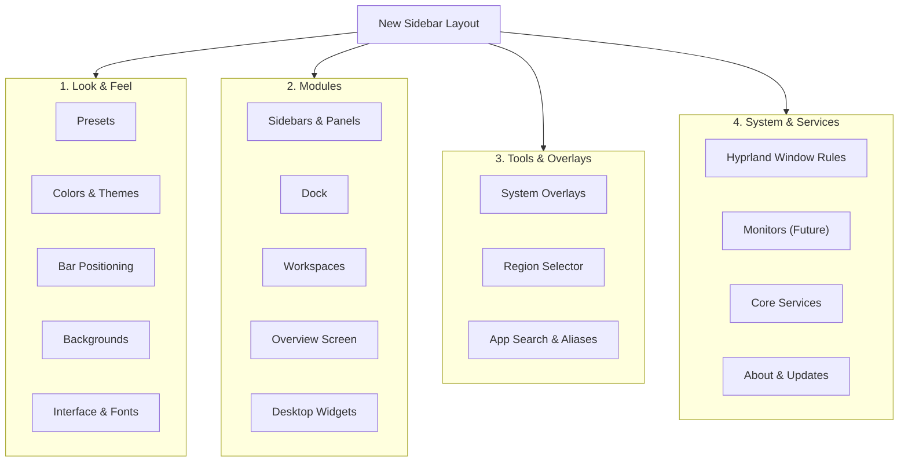

# Settings App Reorganization & Redesign Plan

This document outlines the complete reorganization and layout structure for the new settings application in `ii`. The primary goal is to improve discoverability by grouping settings into logical categories in the sidebar, increasing the number of sidebar pages to reduce internal page clutter, and adopting a cleaner, section-based visual design.

---

## 1. Sidebar Architecture

The sidebar will be structured into collapsible or visually distinct groups. Each group contains 2 or more related pages. We also reserve a future slot for **Monitors** configuration.

### Sidebar Header
The top of the sidebar contains a visual header (not a page) that displays:
*   User Profile Image (Avatar)
*   Greeting ("Hello, [Username]")
*   Search Bar (centered)
*   Close Button (X) at the top right



---

## 2. Visual Page Layout (Section Shapes)

Each settings page will group its widgets into distinct visual cards (shapes) with rounded corners. The section header text sits directly above the card container.

```
+--------------------------------------------------+
|  [Icon] Section Title                            |
|  +--------------------------------------------+  |
|  | [Icon] Switch Option 1              [Toggle] |  |
|  | ------------------------------------------ |  |
|  | [Icon] ComboBox Option 2          [Dropdown] |  |
|  +--------------------------------------------+  |
+--------------------------------------------------+
```

Widgets will remain functionally identical (`StyledComboBox`, `ConfigSwitch`, `ConfigSpinBox`, `ConfigSlider`, `ContentSubsection`, `ConfigSelectionArray`), but their nesting will be flattened to avoid deep visual hierarchy inside the cards.

---

## 3. Comprehensive Page & Option Mapping

Below is the exhaustive mapping of all toggles, spinboxes, text areas, and inputs across the new page structure.

### Group 1: Look & Feel
#### Page 1: Presets (`PresetsConfig.qml`)
Focuses on user customization states and core shell config operations.
*   **Section: Preset Creator**
    *   *Preset name input*: MaterialTextField
    *   *Save Button*: Saves current settings under entered name.
    *   *Import Button*: Imports preset from external files.
*   **Section: Saved Presets**
    *   *Presets Grid / Flow*: Renders all local presets. Each card contains:
        *   Wallpaper thumbnail preview.
        *   Preset name text.
        *   **Load action**: Clicking the preset card.
        *   **Export action**: RippleButton (icon download) to zip settings + wallpaper.
        *   **Delete action**: RippleButton (icon delete) to remove the preset file.
*   **Section: Shell Configuration File**
    *   *Config file button*: Opens the shell configuration file manually.
    *   *Copy Path Button*: Copies the path to `config.json` to the clipboard.
    *   *Notice Box*: Explains that not all options are available in this GUI and the json configuration can be edited directly.
*   **Section: Restart Shell**
    *   *Restart Button*: Restarts Quickshell to apply major changes.

#### Page 2: Colors & Themes (`ColorsConfig.qml`)
Consolidates all system themes, engine controls, and Matugen generator properties.
*   **Section: Appearance Preferences**
    *   *Color Scheme Type*: Light/Dark switches (`Appearance.m3colors.darkmode`)
    *   *Theme Selector*: ColorPreviewGrid containing custom and built-in themes.
*   **Section: Color Engine**
    *   *Color generation mode* (`Config.options.appearance.colorEngine`): ii-vynx or Fork (SelectionArray)
*   **Section: Wallpaper Theming & Matugen Integration** (From AdvancedConfig)
    *   *Theming targets*:
        *   Shell & utilities (`Config.options.appearance.wallpaperTheming.enableAppsAndShell`): Switch
        *   Qt apps (`Config.options.appearance.wallpaperTheming.enableQtApps`): Switch
        *   Terminal (`Config.options.appearance.wallpaperTheming.enableTerminal`): Switch
    *   *Terminal settings*:
        *   Force dark mode in terminal (`Config.options.appearance.wallpaperTheming.terminalGenerationProps.forceDarkMode`): Switch
        *   Terminal: Harmony % (`Config.options.appearance.wallpaperTheming.terminalGenerationProps.harmony`): SpinBox
        *   Terminal: Harmonize threshold (`Config.options.appearance.wallpaperTheming.terminalGenerationProps.harmonizeThreshold`): SpinBox
        *   Terminal: Foreground boost % (`Config.options.appearance.wallpaperTheming.terminalGenerationProps.termFgBoost`): SpinBox
*   **Section: Border Customization** (From HyprlandConfig)
    *   *Borderless windows* (`Config.options.appearance.borderless`): Switch
    *   *Active Border Color Type* (`Config.options.appearance.borderColorType`): Primary, Secondary, Tertiary, Primary Container, Surface (SelectionArray)
*   **Section: Weeb / Random Wallpaper Engines**
    *   *Random: Konachan*: Triggers random download script (visible if weeb policy == 1)
    *   *Random: osu! seasonal*: Triggers random download script (visible if weeb policy == 1)

#### Page 3: Bar Positioning (`BarPositionConfig.qml`)
Manages the positioning, geometry, and base visibility of the shell status bar.
*   **Section: Geometry**
    *   *Bar height* (`Config.options.bar.sizes.height`): SpinBox (30 to 50px)
    *   *Bar width* (`Config.options.bar.sizes.width`): SpinBox (30 to 50px)
*   **Section: Positioning**
    *   *Bar position* (`Config.options.bar.bottom` & `Config.options.bar.vertical`): Top, Left, Bottom, Right (SelectionArray)
    *   *Automatically hide* (`Config.options.bar.autoHide.enable`): Switch
*   **Section: Decorative Styles**
    *   *Corner style* (`Config.options.bar.cornerStyle`): Hug, Float, Rect, Dynamic Island (SelectionArray)
    *   *Group style* (`Config.options.bar.barGroupStyle`): Pills, Island, Transparent (SelectionArray)
    *   *Bar background style* (`Config.options.bar.barBackgroundStyle`): Visible, Adaptive, Transparent (SelectionArray)
    *   *Expressive bar solid colors* (`Config.options.bar.expressiveColors`): Switch
    *   *Expressive color theme* (`Config.options.bar.expressiveColorTheme`): Content, Vibrant, Secondary, Surface (SelectionArray, enabled if expressive colors active)

#### Page 4: Backgrounds (`BackgroundConfig.qml`)
Controls desktop wallpaper movement and scaling behaviors.
*   **Section: Parallax Engine**
    *   *Vertical movement* (`Config.options.background.parallax.vertical`): Switch
    *   *Depends on workspace* (`Config.options.background.parallax.enableWorkspace`): Switch
    *   *Depends on sidebars* (`Config.options.background.parallax.enableSidebar`): Switch
    *   *Preferred wallpaper zoom %* (`Config.options.background.parallax.workspaceZoom`): SpinBox
*   **Section: Transition Animations**
    *   *Animate wallpaper changes* (`Config.options.background.animateWallpaperChanges`): Switch
    *   *Zoom animation when overview/cheatsheet is open* (`Config.options.background.zoomOutEnabled`): Switch
    *   *Zoom background style* (`Config.options.background.zoomOutStyle`): Gnome Like, Default, Zoom In (SelectionArray, visible if zoom overview enabled)
    *   *Experimental - Scale windows with wallpaper* (`Config.options.background.windowZoomOnOverview`): Switch (visible if Gnome Like selected)

#### Page 5: Interface & Fonts (`InterfaceFontsConfig.qml`)
Covers system-wide styling scales, icon theme settings, and font families.
*   **Section: System Rounding**
    *   *Rounding style* (`Config.options.appearance.globalRounding`): Sharp, Normal, Large, V. Large (SelectionArray)
    *   *Toggle window rounding with rounding style* (`Config.options.appearance.toggleWindowRounding`): Switch
*   **Section: Decorative Options**
    *   *Colorful scrollbar* (`Config.options.appearance.colorfulScrollbar`): Switch
    *   *Show AI provider and model buttons* (`Config.options.sidebar.ai.showProviderAndModelButtons`): Switch
*   **Section: Fonts Management** (From AdvancedConfig)
    *   *Enable custom fonts* (`Config.options.appearance.fonts.enableCustom`): Switch
    *   *Main font* (`Config.options.appearance.fonts.main`): TextArea (enabled if custom fonts active)
    *   *Numbers font* (`Config.options.appearance.fonts.numbers`): TextArea (enabled if custom fonts active)
    *   *Title font* (`Config.options.appearance.fonts.title`): TextArea (enabled if custom fonts active)
    *   *Monospace font* (`Config.options.appearance.fonts.monospace`): TextArea (enabled if custom fonts active)
    *   *Nerd font icons* (`Config.options.appearance.fonts.iconNerd`): TextArea (enabled if custom fonts active)
    *   *Reading font* (`Config.options.appearance.fonts.reading`): TextArea (enabled if custom fonts active)
    *   *Expressive font* (`Config.options.appearance.fonts.expressive`): TextArea (enabled if custom fonts active)
*   **Section: Base Icon Themes**
    *   *Themed icons (Experimental)* (`Config.options.appearance.icons.enableThemed`): Switch
    *   *Base icon theme* (`Config.options.appearance.iconTheme`): SelectionArray (visible if themed icons active)
    *   *Apply Theme Button*: Triggers Matugen apply script.
    *   *Auto restart Quickshell on theme change* (`Config.options.appearance.wallpaperTheming.autoRestartQuickshell`): Switch
*   **Section: Tint Icons Fallback**
    *   *Tint workspace icons* (`Config.options.bar.workspaces.monochromeIcons`): Switch
    *   *Tint dock icons* (`Config.options.dock.monochromeIcons`): Switch
    *   *Dim inactive dock icons* (`Config.options.dock.dimInactiveIcons`): Switch (enabled if dock icons not tinted)

---

### Group 2: Modules
#### Page 6: Sidebars & Panels (`SidebarsConfig.qml`)
Configures the right control sidebar, corner mouse hotspots, quick settings panels, and the sidebar's profile header visual properties.
*   **Section: Sidebar Profile Header Settings**
    *   *Profile Image Type* (`Config.options.sidebar.dashboardHeader.profileImageType`): Custom Image, Distro Icon, None (ComboBox)
    *   *Select Image Button*: Triggers image picker process (visible if custom image is selected)
    *   *Header Text Mode* (`Config.options.sidebar.dashboardHeader.textMode`): Username, Uptime, Custom Text, None (ComboBox)
    *   *Custom Header Text* (`Config.options.sidebar.dashboardHeader.customText`): TextArea (visible if custom text mode is selected)
*   **Section: Right Control Sidebar**
    *   *Keep right sidebar loaded* (`Config.options.sidebar.keepRightSidebarLoaded`): Switch
    *   *Sidebar style* (`Config.options.sidebar.sidebarStyle`): Default, Connect (SelectionArray)
    *   *Sidebar position* (`Config.options.sidebar.position`): Default, Inverted, Left, Right (SelectionArray)
*   **Section: Quick Toggles & Sliders**
    *   *Quick toggles style* (`Config.options.sidebar.quickToggles.style`): Classic, Android (SelectionArray)
    *   *Android style Columns* (`Config.options.sidebar.quickToggles.android.columns`): SpinBox (visible if Android style selected)
    *   *Enable quick sliders* (`Config.options.sidebar.quickSliders.enable`): Switch
    *   *Show Brightness* (`Config.options.sidebar.quickSliders.showBrightness`): Switch
    *   *Show Gamma* (`Config.options.sidebar.quickSliders.showGamma`): Switch
    *   *Show Volume* (`Config.options.sidebar.quickSliders.showVolume`): Switch
    *   *Show Microphone* (`Config.options.sidebar.quickSliders.showMic`): Switch
    *   *Vertical layout for sliders* (`Config.options.sidebar.quickSliders.vertical`): Switch
*   **Section: Corner Mouse Actions**
    *   *Enable corner open* (`Config.options.sidebar.cornerOpen.enable`): Switch
    *   *Hover to trigger* (`Config.options.sidebar.cornerOpen.clickless`): Switch
    *   *Force hover open at absolute corner* (`Config.options.sidebar.cornerOpen.clicklessCornerEnd`): Switch
    *   *Vertical offset* (`Config.options.sidebar.cornerOpen.clicklessCornerVerticalOffset`): SpinBox
    *   *Place at bottom* (`Config.options.sidebar.cornerOpen.bottom`): Switch
    *   *Value scroll (Volume/Brightness)* (`Config.options.sidebar.cornerOpen.valueScroll`): Switch
    *   *Visualize corner region* (`Config.options.sidebar.cornerOpen.visualize`): Switch
    *   *Region width* (`Config.options.sidebar.cornerOpen.cornerRegionWidth`): SpinBox
    *   *Region height* (`Config.options.sidebar.cornerOpen.cornerRegionHeight`): SpinBox
*   **Section: Dashboard Panel Button**
    *   *Visible status indicators*: Switches for Volume, Microphone, Network, Bluetooth, and Notifications.

#### Page 7: Dock (`DockConfig.qml`)
Controls the application dock's behavior, positioning, and preview features.
*   **Section: Dock Settings**
    *   *Enable* (`Config.options.dock.enable`): Switch
    *   *Isolate monitors* (`Config.options.dock.isolateMonitors`): Switch
    *   *Enable windows preview* (`Config.options.dock.enablePreview`): Switch
    *   *Hover to reveal* (`Config.options.dock.hoverToReveal`): Switch
    *   *Pinned on startup* (`Config.options.dock.pinnedOnStartup`): Switch
    *   *Enable media widget* (`Config.options.dock.enableMediaWidget`): Switch
    *   *Dock height* (`Config.options.dock.height`): SpinBox
    *   *Dock position* (`Config.options.dock.position`): Auto, Bottom, Top, Left, Right (SelectionArray)

#### Page 8: Workspaces (`WorkspacesConfig.qml`)
Configures the workspace switcher widget on the status bar.
*   **Section: Display Options**
    *   *Use workspace map* (`Config.options.bar.workspaces.useWorkspaceMap`): Switch
    *   *Always show numbers* (`Config.options.bar.workspaces.alwaysShowNumbers`): Switch
    *   *Show app icons* (`Config.options.bar.workspaces.showAppIcons`): Switch
    *   *Dynamic workspaces* (`Config.options.bar.workspaces.dynamicWorkspaces`): Switch
    *   *Workspaces shown* (`Config.options.bar.workspaces.shown`): SpinBox (enabled if dynamic workspaces disabled)
    *   *Maximum window count per workspace* (`Config.options.bar.workspaces.maxWindowCount`): SpinBox
    *   *Number show delay when pressing Super* (`Config.options.bar.workspaces.showNumberDelay`): SpinBox
    *   *Number style* (`Config.options.bar.workspaces.numberMap`): Normal, Han chars, Roman (SelectionArray)
*   **Section: Shape Customization**
    *   *Apply shape mask to icons* (`Config.options.appearance.icons.enableShapeMask`): Switch
    *   *Icon mask shape* (`Config.options.appearance.icons.shapeMask`): SelectionArray (visible if icon shape mask active)
    *   *Use Material Shape for active indicator* (`Config.options.bar.workspaces.useMaterialShapeForActiveIndicator`): Switch
    *   *Active indicator shape* (`Config.options.bar.workspaces.activeIndicatorShape`): SelectionArray (visible if active indicator shape active)
    *   *Use random shape for active indicator* (`Config.options.bar.workspaces.useRandomShapeForActiveIndicator`): Switch (enabled if Material Shape is off)

#### Page 9: Overview Screen (`OverviewConfig.qml`)
Manages the full-screen window overview dashboard.
*   **Section: Overview Configuration**
    *   *Enable* (`Config.options.overview.enable`): Switch
    *   *Show icons* (`Config.options.overview.showIcons`): Switch
    *   *Center icons* (`Config.options.overview.centerIcons`): Switch
    *   *Use workspace map* (`Config.options.overview.useWorkspaceMap`): Switch
    *   *Scale %* (`Config.options.overview.scale`): SpinBox
    *   *Enable zoom animation* (`Config.options.overview.showOpeningAnimation`): Switch
    *   *Zoom style* (`Config.options.overview.scrollingStyle.zoomStyle`): In, Out (SelectionArray, visible if zoom animation active)
*   **Section: Classic Style**
    *   *Rows* (`Config.options.overview.rows`): SpinBox
    *   *Columns* (`Config.options.overview.columns`): SpinBox
    *   *Horizontal direction* (`Config.options.overview.orderRightLeft`): Left to right, Right to left (SelectionArray)
    *   *Vertical direction* (`Config.options.overview.orderBottomUp`): Top-down, Bottom-up (SelectionArray)
*   **Section: Background Style**
    *   *Dim percentage* (`Config.options.overview.scrollingStyle.dimPercentage`): SpinBox (enabled if dim style active)
    *   *Background style* (`Config.options.overview.scrollingStyle.backgroundStyle`): Blur, Dim, Transparent (SelectionArray)

#### Page 10: Desktop Widgets (`WidgetsConfig.qml`)
Aggregates options for all floating widgets placed on the desktop background.
*   **Section: Widget Manager**
    *   *Clock Widget* (`Config.options.background.widgets.clock.enable`): Switch
    *   *Clock Placement Strategy*: Draggable, Least busy, Most busy (SelectionArray)
    *   *Weather Widget* (`Config.options.background.widgets.weather.enable`): Switch
    *   *Weather Placement Strategy*: Draggable, Least busy, Most busy (SelectionArray)
    *   *Media Widget* (`Config.options.background.widgets.media.enable`): Switch
    *   *Media Placement Strategy*: Draggable, Least busy, Most busy (SelectionArray)
*   **Section: Clock Options**
    *   *Show only when locked* (`Config.options.background.widgets.clock.showOnlyWhenLocked`): Switch
    *   *Clock style* (`Config.options.background.widgets.clock.style`): Digital, Cookie, Nagasaki (SelectionArray, visible if unlocked)
    *   *Clock style (locked)* (`Config.options.background.widgets.clock.styleLocked`): Digital, Cookie, Nagasaki (SelectionArray)
    *   *Digital Style Settings*:
        *   Vertical, Animate time, Show date, Adaptive alignment, Colorful digits, Show colon (Switches)
        *   Font family (TextArea), Font weight, Font size, Font width, Font roundness (Sliders)
    *   *Cookie Style Settings*:
        *   Sides (SpinBox), Constantly rotate, Hour marks, Digits in middle (Switches)
        *   Auto style with AI (Switch), AI model: Gemini, OpenRouter (SelectionArray)
        *   Dial style: none, dots, full, numbers (SelectionArray)
        *   Hour hand: hide, classic, hollow, fill (SelectionArray)
        *   Minute hand: hide, classic, thin, medium, bold (SelectionArray)
        *   Second hand: hide, classic, line, dot (SelectionArray)
        *   Date style: hide, bubble, border, rect (SelectionArray)
        *   Background style: hide, sine, cookie, shape (SelectionArray)
        *   Background shape (SelectionArray, visible if background style is shape)
    *   *Quote Settings*:
        *   Enable quote (`Config.options.background.widgets.clock.quote.enable`): Switch
        *   Quote text (`Config.options.background.widgets.clock.quote.text`): TextArea
*   **Section: Media Widget Options**
    *   *Media style* (`Config.options.background.widgets.media.style`): Circular, Expressive (SelectionArray)
    *   *Circular Style Settings*:
        *   Use album colors, Tint art cover, Hide all controls, Show previous toggle (Switches)
        *   Background shape (SelectionArray)
    *   *Glow effect settings*:
        *   Enable glow (`Config.options.background.widgets.media.glow.enable`): Switch
        *   Brightness (`Config.options.background.widgets.media.glow.brightness`): SpinBox
    *   *Visualizer settings*:
        *   Enable visualizer (`Config.options.background.widgets.media.visualizer.enable`): Switch
        *   Opacity, Smoothing, Blur (SpinBoxes)

---

### Group 3: Tools & Overlays
#### Page 11: System Overlays (`OverlaysConfig.qml`)
Controls auxiliary utility HUDs layered on top of screens.
*   **Section: General**
    *   *Enable opening zoom animation* (`Config.options.overlay.openingZoomAnimation`): Switch
    *   *Darken screen* (`Config.options.overlay.darkenScreen`): Switch
*   **Section: Crosshair**
    *   *Crosshair code* (`Config.options.crosshair.code`): TextArea (Valorant format)
    *   *Editor link*: Button that opens online builder.
*   **Section: Floating Image**
    *   *Image source* (`Config.options.overlay.floatingImage.imageSource`): TextArea
*   **Section: Notes**
    *   *Show tabs* (`Config.options.overlay.notes.showTabs`): Switch
    *   *Allow editing the icon* (`Config.options.overlay.notes.allowEditingIcon`): Switch (enabled if tabs are shown)
*   **Section: Media Overlay**
    *   *Show slider* (`Config.options.overlay.media.showSlider`): Switch
    *   *Background opacity %* (`Config.options.overlay.media.backgroundOpacityPercentage`): SpinBox
    *   *Use lyrics gradient masking* (`Config.options.overlay.media.useGradientMask`): Switch
    *   *Lyrics font size* (`Config.options.overlay.media.lyricSize`): SpinBox

#### Page 12: Region Selector (`RegionSelectorConfig.qml`)
Configures region capture actions like screenshot snipping or Circle to Search.
*   **Section: General Behavior**
    *   *Show only on focused monitor* (`Config.options.regionSelector.showOnlyOnFocusedMonitor`): Switch
*   **Section: Hint Target Regions**
    *   *Targets*: Windows, Layers, Content (Switches)
*   **Section: Google Lens Selection**
    *   *Selection mode*: Rectangular, Circle to Search (SelectionArray)
*   **Section: Rectangular Selection**
    *   *Show aim lines* (`Config.options.regionSelector.rect.showAimLines`): Switch
*   **Section: Circle Selection**
    *   *Stroke width* (`Config.options.regionSelector.circle.strokeWidth`): SpinBox
    *   *Padding* (`Config.options.regionSelector.circle.padding`): SpinBox

#### Page 13: App Search & Aliases (`AppSearchConfig.qml`)
Configures the application launcher, command lines, and clipboard history search.
*   **Section: Search Behavior**
    *   *Frequency-based ranking* (`Config.options.search.frecency`): Switch
    *   *Show default actions without prefix* (`Config.options.search.prefix.showDefaultActionsWithoutPrefix`): Switch
    *   *Non-app result delay* (`Config.options.search.nonAppResultDelay`): SpinBox
    *   *Blur file search previews* (`Config.options.search.blurFileSearchResultPreviews`): Switch
    *   *Enable built-in system controls* (`Config.options.search.enableSystemControls`): Switch
    *   *Enable math & unit previews* (`Config.options.search.enableMathPreview`): Switch
    *   *Always list apps on empty query* (`Config.options.search.alwaysListApps`): Switch
*   **Section: Search Prefixes**
    *   *Prefix inputs*: Inputs for Action, App, Clipboard, Emojis, Math, Shell command, Web search, Window search, File browser, File search, Bluetooth, and Translator.
*   **Section: App Aliases**
    *   *Add Alias form*: Alias input (text), Target path (text), Selection type (App, Folder, Command, Built-in).
    *   *Frequent/Matched app list*: Interactive chips to select application IDs.
    *   *Built-in system targets*: Quick select chips (Clipboard, Emojis, Math, Bluetooth, Translator, Settings).
    *   *Current aliases list*: Displays all active aliases with type icons and delete buttons.
*   **Section: Clipboard History Search**
    *   *Detectors*: Switches for Hex color, URL, Email, Phone, JSON, Multiline, Number, Markdown, and File path.
    *   *Customization*:
        *   Panel width px (`Config.options.search.clipboard.panelWidth`): Slider
        *   List column ratio % (`Config.options.search.clipboard.listColumnRatio`): Slider
        *   Image preview height px (`Config.options.search.clipboard.imageHeight`): Slider
        *   Text preview font size pt (`Config.options.search.clipboard.previewFontSize`): Slider
        *   Show metadata panel (`Config.options.search.clipboard.showMetadata`): Switch
        *   Fuzzy search (`Config.options.search.clipboard.enableSloppySearch`): Switch
*   **Section: Directories & Targets**
    *   *Search engine base URL* (`Config.options.search.engineBaseUrl`): TextArea
    *   *File search directory* (`Config.options.search.fileSearchDirectory`): TextArea

---

### Group 4: System & Services
#### Page 14: Hyprland Window Rules (`HyprlandRulesConfig.qml`)
Controls window behavior, border layouts, transparency values, and gaps.
*   **Section: Transparency & Blur**
    *   *Enable transparency* (`Config.options.appearance.transparency.enable`): Switch
    *   *Calculate transparency automatically* (`Config.options.appearance.transparency.automatic`): Switch
    *   *Transparency in popups* (`Config.options.appearance.transparency.popups`): Switch
    *   *Background transparency* (`Config.options.appearance.transparency.backgroundTransparency`): Slider (enabled if manual)
    *   *Content transparency* (`Config.options.appearance.transparency.contentTransparency`): Slider (enabled if manual)
    *   *Blur Size* (`Config.options.appearance.blurSize`): Slider
    *   *Ignore Alpha* (`Config.options.appearance.ignoreAlpha`): Slider
*   **Section: Borders & Gaps**
    *   *Gaps In* (`Config.options.appearance.gapsIn`): Slider
    *   *Gaps Out* (`Config.options.appearance.gapsOut`): Slider
*   **Section: Windows General**
    *   *Hyprland default layout* (`Config.options.hyprland.defaultHyprlandLayout`): Default, Scrolling (SelectionArray)

#### Page 15: Monitors (`MonitorsConfig.qml`)
*A dedicated slot reserved in the new sidebar grouping.*
*   **Section: Monitor Layout (Future Implementation)**
    *   Contains placeholder configurations for Hyprland monitors (Resolution, refresh rate, scale, rotation, and positioning).

#### Page 16: Core Services (`CoreServicesConfig.qml`)
Manages back-end system properties: audio limits, energy warnings, clocks, networks, LocalSend, and work safety policies.
*   **Section: Audio Controls**
    *   *Earbang protection* (`Config.options.audio.protection.enable`): Switch
    *   *Max allowed volume increase* (`Config.options.audio.protection.maxAllowedIncrease`): SpinBox
    *   *Volume limit* (`Config.options.audio.protection.maxAllowed`): SpinBox
*   **Section: Power & Battery Management**
    *   *Battery Icon Style* (`Config.options.battery.style`): Windows 11, Android 16, One UI (ComboBox)
    *   *Low warning* (`Config.options.battery.low`): SpinBox
    *   *Critical warning* (`Config.options.battery.critical`): SpinBox
    *   *Automatic suspend* (`Config.options.battery.automaticSuspend`): Switch
    *   *Suspend at %* (`Config.options.battery.suspend`): SpinBox
    *   *Full battery warning* (`Config.options.battery.full`): SpinBox
*   **Section: Time & Date Formats**
    *   *Second precision* (`Config.options.time.secondPrecision`): Switch
    *   *Start week on Monday* (`Config.options.time.firstDayOfWeek`): Switch
    *   *Clock Format*: 24h, 12h am/pm, 12h AM/PM (SelectionArray)
    *   *Date Format*: Date First dd/MM, Month First MM/dd (SelectionArray)
*   **Section: Interactive Alerts**
    *   *Interface Language* (`Config.options.language.ui`): ComboBox (with Gemini AI translation generator form)
    *   *Translator defaults*: Default source language, default target language (ComboBoxes)
    *   *Sound notifications*: Battery, Pomodoro (Switches)
*   **Section: Media Integrations**
    *   *Prioritized player* (`Config.options.media.priorityPlayer`): TextArea
    *   *Filter duplicate players* (`Config.options.media.filterDuplicatePlayers`): Switch
    *   *Music Recognition*: Timeout (SpinBox), Polling interval (SpinBox)
    *   *Lyrics services*: Enable lyrics (Switch), Genius lyrics (Switch), LrcLib lyrics (Switch)
*   **Section: Work Safety & Policies**
    *   *Hiding Suspects*: Hide clipboard images (Switch), Hide suspect/anime wallpapers (Switch)
    *   *Policies settings*: AI (No, Yes, Local), Weeb (No, Yes, Closet), Wallpaper browser (No, Yes), Translator (No, Yes), Sidebar player (No, Yes) (SelectionArrays)
*   **Section: Network & Performance Utilities**
    *   *User agent string* (`Config.options.networking.userAgent`): TextArea
    *   *Resources polling interval* (`Config.options.resources.updateInterval`): SpinBox
    *   *Save paths*: Video record path (TextArea), Use OBS for recording (Switch), Screenshot path (TextArea)
    *   *LocalSend CLI*: Auto-start, show notifications, prefer popup over notification (Switches), Download path (TextArea)
    *   *Wallpaper Browser download path*: TextArea
    *   *Weather service*: Enable GPS, Fahrenheit unit (Switches), City name (TextArea), Polling interval (SpinBox)
    *   *Bluetooth Device Images*: Select device list, assign artwork upload, managed devices collection.

#### Page 17: About & Updates (`AboutConfig.qml`)
Display information, updates check, git source switching, and changelog.
*   **Section: System Info**
    *   *Distro Info*: System logo, name, home URL, Documentation, Help, Bug report, Privacy buttons.
    *   *Parent-Dots Info*: illogical-impulse GitHub link, Wiki Docs, Issues, Discussions, Sponsors buttons.
    *   *Dotfiles Info*: ii-vynx GitHub link, Wiki, Known issues buttons.
*   **Section: Git Source & Update Controls**
    *   *Source updater*: Update Fork, Update Upstream buttons with real-time build output log parsing.
    *   *Source Switcher*: Switch to P3DROVFX Fork, Switch to Upstream (buttons calling install script).
*   **Section: Commit History**
    *   *Changelog viewer*: Lists latest Git commit hashes, titles, descriptions, and tag components.
